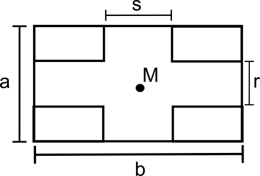
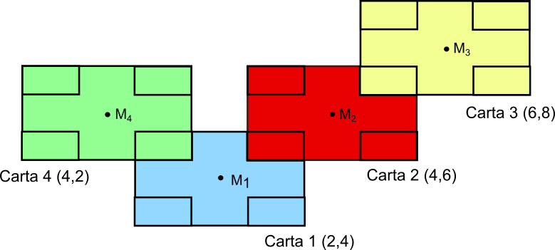

# Rappresentare la mappa sulla GUI

## Determinare la posizione delle carte sullo schermo

Ogni carta viene rappresentata nella GUI come un'immagine:

:

Dove a e b sono le dimensioni in pixel della carta, r ed s lo spazio tra gli angoli
(considerati di dimensioni uguali). Ogni carta ha anche un centro, M.

Nel nostro caso, i parametri sono:
- a = 556
- b = 831
- r = 106
- s = 462


A partire dalle coordinate cartesiane delle celle occupate dalle carte (es. (-2,2)),
vogliamo determinare la posizione corrispondente sullo schermo del centro della carta,
esprimendo le coordinate in pixel

Nel seguito, utilizzeremo la seguente notazione:
- x<sub>i, P</sub> : ascissa in pixel del centro della carta i
- y<sub>i, C</sub> : ascissa in coordinate cartesiane del centro della carta i

Consideriamo alcune carte, nella seguente disposizione:



Se, a partire dal centro della carta 1, vogliamo determinare
la posizione del centro della carta 2, abbiamo:

- x<sub>2, P</sub> = x<sub>1, P</sub> + (b + s)/2

- y<sub>2, P</sub> = y<sub>1, P</sub> + (a + r)/2

Questo procedimento può essere iterato anche per le altre carte,
ad esempio, dalla carta 3 alla carta 2:

- x<sub>3, P</sub> = x<sub>2, P</sub> + (b + s)/2 = x<sub>1, P</sub> + 2 * \[(b + s)/2\]

- y<sub>3, P</sub> = x<sub>2, P</sub> + (a + r)/2 = y<sub>1, P</sub> + 2 * \[(a + r)/2\]

Oppure, dalla carta 1 alla 4:

- x<sub>4, P</sub> = x<sub>1, P</sub> - (b + s)/2 

- y<sub>4, P</sub> = x<sub>1, P</sub> + (a + r)/2

In generale, indichiamo con x<sub>0, P</sub> e y<sub>0, P</sub>
le coordinate in pixel della carta iniziale, ovvero quella di coordinate (0, 0).
Allora, la posizione di ogni altra carta i sarà data da:

- x<sub>i, P</sub> = x<sub>0, P</sub> + (x<sub>i, C</sub> /2) + (b + s)/2
- y<sub>i, P</sub> = y<sub>0, P</sub> + (y<sub>i, C</sub> /2) + (b + s)/2

Dove x<sub>i, C</sub> e y<sub>i, C</sub> sono le
coordinate cartesiane delle carte (es (-2, 2))
Tali coordinate vanno divise per 2 per tenere conto del fatto
che, sulla mappa, le carte si trovano tutte in posizioni pari.

### Altre note

- Affinché le coordinate dei centri delle carte siano tutte intere,
  è necessario che a, b, r, ed s siano valori dispari di pixel
- Le formule di cui sopra valgono anche se, al posto delle coordinate
  dei centri delle carte, si vogliono utilizzare quelle dell'angolo in 
  alto a sinistra: infatti, tale punto si ottiene traslando il centro di
  (- b/2, + a/2)

## Disporre e sovrapporre le carte sulla mappa

Una volta determinata la posizione delle carte sulla mappa, 
bisogna disporle in maniera tale che gli angoli 
siano coperti correttamente. Per fare questo, si può provare
a rappresentare le carte sullo schermo aggiungendole una alla volta,
in modo tale che le carte inserite prima vengano (parzialmente) coperte
da quelle aggiunte dopo. 

Utilizzando le informazioni disponibili dentro 
GameFieldInfo, si può utilizzare il seguente algoritmo.

- A partire dalla carta iniziale, controlliamo gli angoli adiacenti
- Per ciascuno di essi, se troviamo che è coperto (ovvero la carta superiore è diversa
dalla carta iniziale), recuperiamo la carta nella posizione corrispondente e 
stampiamola a schermo.
- Ripetiamo questo procedimento per tutte le carte appena aggiunte, fino ad esaurire
  tutte le carte presenti sulla mappa

### Pseudocodice

```java
import it.polimi.ingsw.dataobject.CardCellInfo;
import java.util.HashSet;

public void displayMap() {

    // Informazioni da GameFieldInfo
    Set<Point> cards = gameFieldInfo.placedCards().keys();
    Set<Point> angles = gameFieldInfo.placedAngles().keys();
    
    Set<Point> cardsToExamine = new HashSet<>();
    
    // Aggiungiamo la carta iniziale
    cardsToExamine.add(Point(0, 0)); 

    while (!cardsToExamine.isEmpty()) {
        // Per ogni carta da esaminare
        for (Point card : cardsToExamine) {
            // Esaminiamo gli angoli adiacenti
            for (Point adjacentAngle : card.getAdjacentPositions()) {

                coveringCard = angles.get(adjacentAngle).topCardPosition();

                // Se l'angolo è coperto da una carta diversa da quella considerata
                if (!coveringCard.equals(card)) {
                    // Aggiungi la carta sullo schermo, nella giusta posizione
                    addToScreen(coveringCard);
                    cardsToExamine.add(coveringCard);
                }
            }
        }
    }
}
```

La complessità di questo algoritmo è O(n), con n numero delle carte
sulla mappa: ciascuna di esse viene esaminata una volta, e per ogni carta
si esaminano i 4 angoli adiacenti. 

Si può ridurre il carico computazionale dell'algoritmo tenendo salvata
una rappresentazione della mappa a uno stato precedente e 
aggiungendo solo le carte che sono state posizionate dopo.
Questo è particolarmente semplice nel caso della mappa del 
giocatore controllato (per cui si vedono le mosse che vengono fatte).

Infine, dopo aver stampato tutta la mappa, si possono 
rappresentare le posizioni in cui è possibile giocare una carta
come overlay sovrapposti (le coordinate sono nel campo
`GameFieldInfo.availablePositions()`).